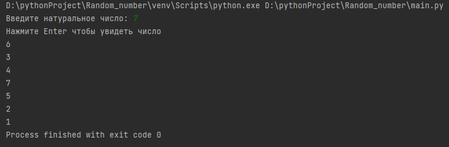
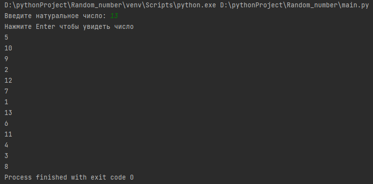
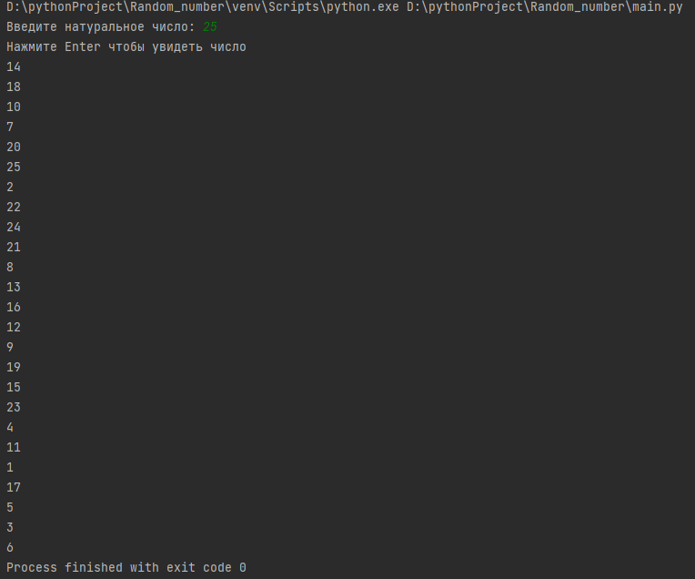

# Lab-9
# Автор программы
Лада Александр Фт-220007
# Описание программы
Данная программа генерирует на основании введённых данных последовательность чисел от 1 до N в случайном порядке
# Среда разработки программы
Программа запускается в любой IDE для Python
Среда разработки: Visual Studio Code
Необходимо открыть файл: main.py
После запуска следовать инструкциям программы
# Ввод
-натуральное число N
# Вывод
-последовательность чисел от 1 до N в случайном порядке

# Тесты
Тест 1 (N=7)
___

___
Тест 2 (N=13)
___

___
Тест 3 (N=25)
___

 